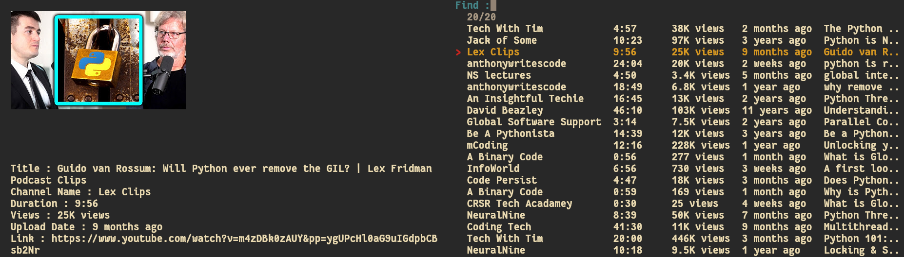

# sYT



> Search , Watch and Download YouTube videos from terminal without youtube API

## Dependencies

-   python 3.5+ (For scrapping data)
-   ueberzug (For displaying images)
-   fzf or dmenu (For menu)
-   jq (For formatting json)
-   mpv (For playing video)
-   yt-dlp (For getting video qualities)
-   aria2c (For downloading videos)

## Installation

#### Add Path

> Must add ~/.local/bin to your shell path

Example how to add ~/.local/bin/ in the PATH Variable <br>

<b>POSIX based shell (bash,zsh,dash,....) </b>

<em>Change bashrc to your repective shell's rc</em>

```
echo 'export PATH=~/.local/bin:$PATH' >> $HOME/.bashrc
```

<b>Fish shell </b>

```
echo 'set PATH ~/.local/bin/ $PATH' >> $HOME/.config/fish/config.fish
```

#### Install ueberzug guide

<em>The original ueberzug project has been abandoned by its original author.
But there are some people who are continuing its legacy.
You can install ueberzug by using the below commands.
I know projects like `ueberzugpp` exists but for now
my project supports only `ueberzug` backend
to display images.</em>

```sh
git clone https://github.com/ueber-devel/ueberzug;
cd ueberzug/
pip install .
cd ..
rm -rf ueberzug
```

#### Install script

```sh

# INSTALL SCRIPT
git clone https://github.com/glowfi/sYT
cd sYT
mkdir -p ~/.local/bin
cp -r ./sYT.py ~/.local/bin/
cp -r ./sYT.sh ~/.local/bin/
cd ..
rm -rf sYT
chmod +x ~/.local/bin/sYT.py
chmod +x ~/.local/bin/sYT.sh

```

## How to Use

```sh


### Algorithms
+ algov1 -> No dependencies pure web scraping and uses only inbuilt python libraries (slow)
+ algov2 -> Uses invidious youtube api (fast) (default)

### ONLY WATCH VIDEOS
Example 1: sYT.sh -p "fzf"       [Watch videos with fzf as provider]
Example 2: sYT.sh -p "dmenu"     [Watch videos with dmenu as provider]

### USING SPECIFIC ALGOS
Example 1: sYT.sh -a "v1"       [Use algov1]
Example 2: sYT.sh -a "v2"    [Use algov2]


#### DOWNLOAD BY SEARCHING VIDEOS
Note : For downloading -d flag must be given as true for downloading searched videos.

-p    | --provider      Fzf or Dmenu
-d    | --download      Download searched video (true or false) [Only download do not play the video]
-ml   | --multilink     Download multiple youtube videos fzf as provider.

Example 1: sYT.sh -d  "true" -p "fzf"            [Download single searched videos with fzf as provider]
Example 2: sYT.sh -d  "true" -p "fzf" -ml "true" [Download multiple searched videos with fzf as provider]


#### DOWNLOAD BY PASSING LINKS AS ARGUMENTS
Note : For downloading videos directly by passing link as arguments.

-dl   | --dlink         Download any youtube video with a single link dmenu as provider.
-fl   | --flink         Download any youtube video with a single link fzf as provider.
-flm  | --flinkmulti    Download any youtube video with multiple link fzf as provider.
-mav  | --mergeaudvid   Merge audio and video with fzf as provider.

Example 1: sYT.sh -fl  "https://youtube.com/abcdef" -p "fzf" [Pass the link as argument if u want to uses fzf]

Example 2: sYT.sh -flm "https://youtube.com/abc https://youtube.com/345" -p "fzf" [Pass multi link as argument if u want to uses fzf]

Note :  Dmenu will ask you to paste the link in the prompt.Pass true or false for dl

Example 3: sYT.sh -p "dmenu" -dl "true" [Dmenu supports only single link]

Example 4: sYT.sh -d "true" -mav "true"

-h   | --help          Prints help

```
